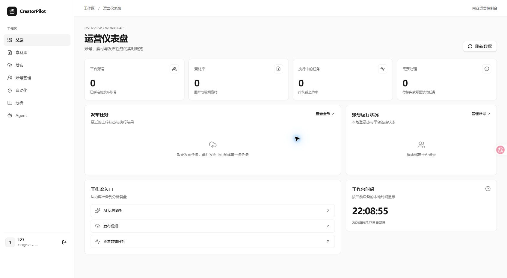
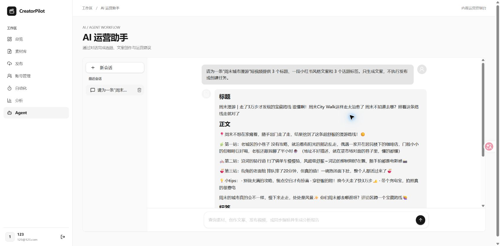
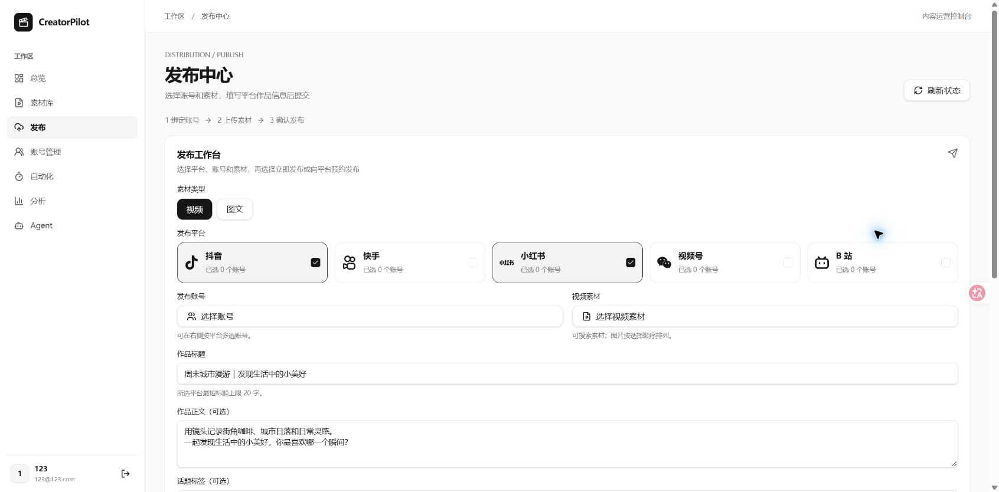
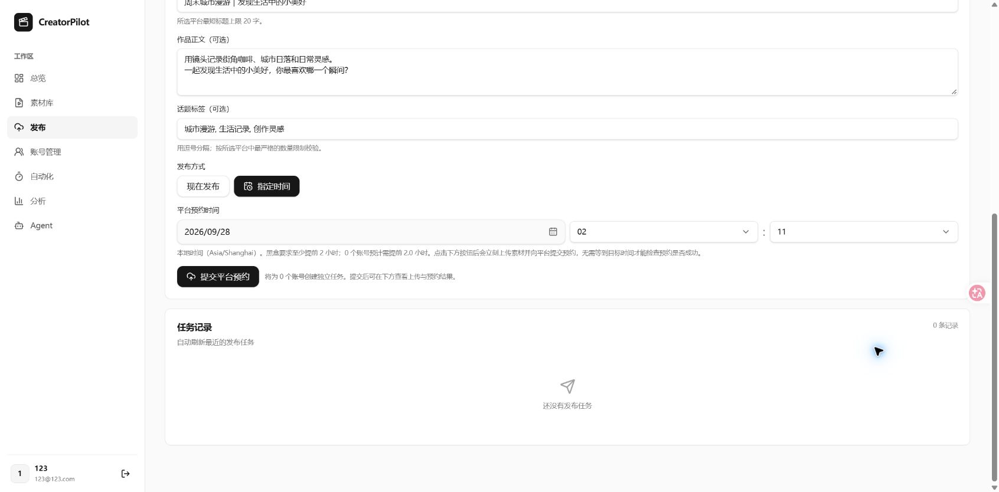
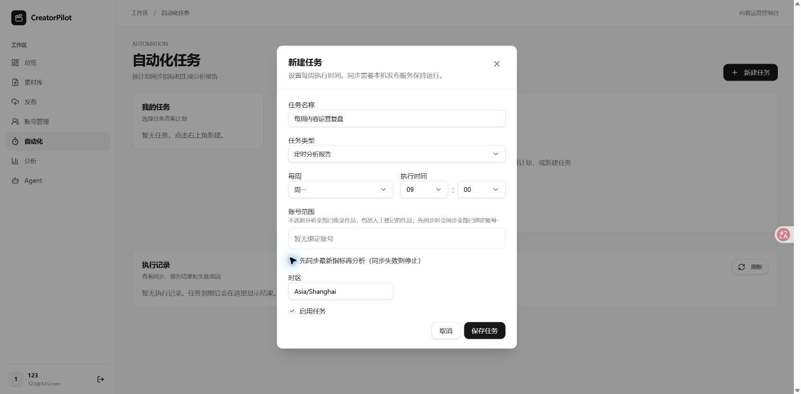
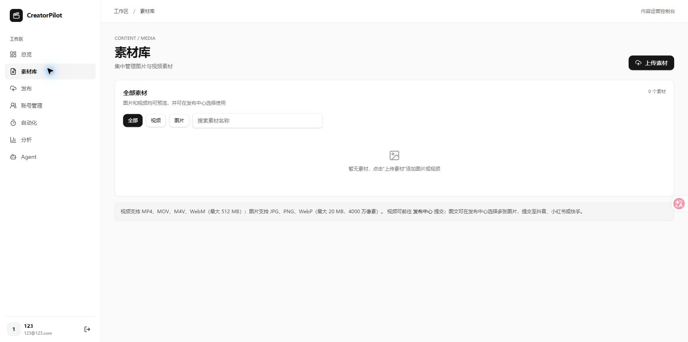
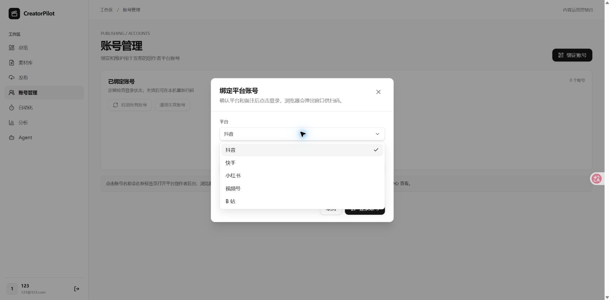
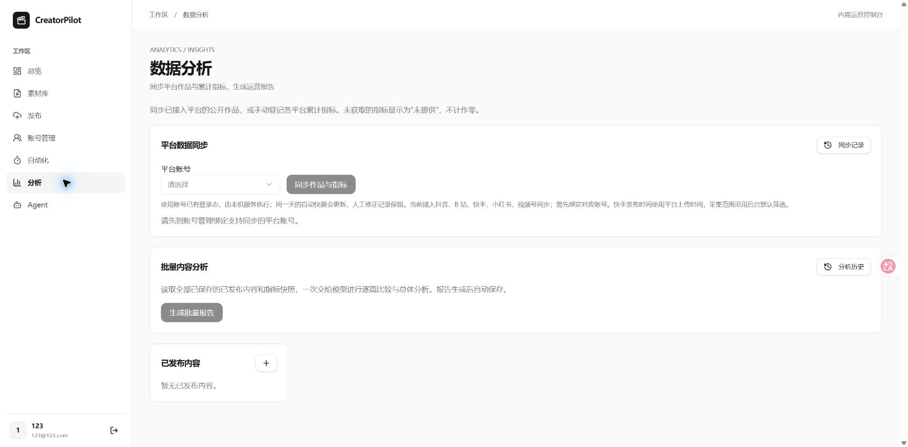
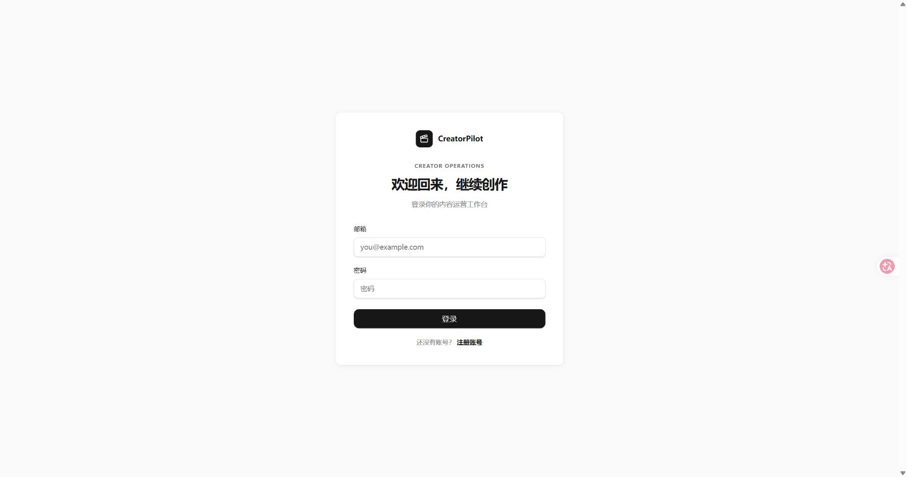

# CreatorPilot

[](LICENSE)
[](https://github.com/ChiYuouo/CreatorPilot/stargazers)
[](https://github.com/ChiYuouo/CreatorPilot/network/members)
[](https://github.com/ChiYuouo/CreatorPilot/issues)
[](https://www.python.org/downloads/)
[](https://github.com/ChiYuouo/CreatorPilot)

**🤖 本项目 95% 的代码由 AI 辅助完成，使用 GPT 6作为核心开发助手。包括GitHub仓库创建、代码提交、开源发布等全部流程均由AI辅助完成。**

AI 内容运营平台，将内容创作、素材管理、多账号发布和运营分析集中在一个工作台中。

当前版本：**v1.0**。

[功能](#功能) · [界面展示](#界面展示) · [快速开始](#快速开始) · [配置](#配置) · [开发指南](DEVELOPMENT.md) · [常见问题](#常见问题)

## 功能

- **AI 运营助手**：对话生成内容，查询素材与账号，提交发布和分析任务。
- **素材管理**：上传、管理和预览图片、视频。
- **多账号发布**：绑定平台账号，立即上传内容或提交平台预约。
- **运营分析**：同步作品指标，生成并保存分析报告。
- **每周自动化**：定时同步指标、生成报告，支持先同步再分析。

目前接入抖音、快手、小红书、视频号和 B 站。各平台的发布类型、预约和采集能力以页面说明为准，部分流程仍需真实账号验收。上传器返回“已提交”后，请到平台确认作品是否公开。

## 界面展示

前端采用简洁的黑白配色、侧边导航与卡片布局，将创作、素材、发布和复盘集中在同一工作台。

以下截图来自本机运行的 v1.0。AI 文案为真实对话生成结果；发布与自动化配置为未提交的操作示例。新账号尚未绑定平台、上传素材或产生发布数据，因此部分页面展示初始空状态。

### 动画演示

https://github.com/user-attachments/assets/e7eb28a6-ac0c-4fe9-8619-73ed195c9ce0

### 运营总览

集中查看账号、素材、执行中任务和待处理事项，通过工作流入口进入创作、发布与分析。



### AI 运营助手

输入创作需求，生成标题、正文、话题标签和运营建议。示例展示“周末城市漫游”文案创作与会话管理。



### 多平台发布

使用流程：绑定账号 → 上传素材 → 选择平台与账号 → 填写标题、正文和标签 → 选择立即发布或平台预约 → 查看任务记录。



<details>
<summary>查看预约发布与其他功能页面</summary>

#### 平台预约

选择日期与时间，将素材上传并向平台提交预约；提交后在任务记录中核实结果。



#### 每周自动化

配置任务类型、执行星期、时间与时区，可选择先同步最新指标再生成分析报告。



#### 素材管理

集中上传、搜索和筛选图片与视频，已有素材可在发布中心选择使用。



#### 平台账号

选择抖音、快手、小红书、视频号或 B 站，按页面提示完成账号绑定。



#### 运营分析

绑定账号并收录作品后，可同步平台指标、生成批量报告，查看同步记录和分析历史。



#### 登录入口



</details>

## 技术栈与运行方式

| 模块 | 技术 | 运行位置 |
| --- | --- | --- |
| 前端 | React、TypeScript、Vite | 本机 |
| 后端 API | FastAPI、SQLAlchemy、Alembic | 本机 |
| AI 编排 | LangGraph、OpenAI 兼容模型接口 | 后端进程 |
| 发布与指标采集 | Celery、Patchright、项目内上传器 | 本机 Worker 与浏览器 |
| 分析与定时任务 | Celery Worker、Beat | Docker |
| 数据库与队列 | PostgreSQL、Redis | Docker |

**当前提供 Windows 本机部署流程。** 前后端不使用 Docker；发布登录需要可见浏览器，B 站登录需要 Windows 终端。

## 快速开始

### 环境要求

- Windows，支持 Python 启动器 `py`。
- Python **3.12**。上传器不支持 Python 3.13。
- Node.js **22 LTS** 和 npm。
- Docker Desktop 与 Docker Compose v2，使用 Linux 容器。
- OpenAI 兼容模型服务的 API 密钥，用于 AI 对话和分析。

提前启动 Docker Desktop。首次安装会下载依赖和 Chromium，需要能够访问相关下载源。

以下命令使用 **PowerShell**。仓库根目录指包含本 README 和 `docker-compose.yml` 的目录。下载源码后，在该目录打开终端；安装步骤结束会返回根目录，可按顺序执行。启动应用时再分别打开三个终端。

### 1. 创建配置

在仓库根目录执行：

```powershell
if (-not (Test-Path backend/.env)) {
    Copy-Item backend/.env.example backend/.env
}
py -3.12 -c "import secrets; print(secrets.token_hex(32))"
```

编辑 `backend/.env`，将生成的随机值填入 `SECRET_KEY`，填写 `LLM_API_KEY`。默认模型服务为 DeepSeek；使用其他服务时同时修改 `LLM_BASE_URL` 和 `LLM_MODEL`。

已有配置时直接编辑 `.env`，不要重复复制模板。未填写模型密钥时，AI 对话和分析不可用。

### 2. 启动数据库与 Redis

在仓库根目录执行：

```powershell
docker compose --env-file backend/.env up -d postgres redis
docker compose --env-file backend/.env ps
```

等待两个服务显示 `healthy`，再继续初始化数据库。

### 3. 安装后端与上传器

从仓库根目录执行：

**后端与数据库迁移：**

```powershell
cd backend
py -3.12 -m venv .venv
.venv/Scripts/python.exe -m pip install -e .
.venv/Scripts/python.exe -m alembic upgrade head
cd ..
```

**上传器与浏览器：**

```powershell
cd backend
py -3.12 -m venv .venv-publish
.venv-publish/Scripts/python.exe -m pip install -r requirements-publisher.txt
.venv-publish/Scripts/patchright.exe install chromium
cd ..
```

两个虚拟环境共用本机 Python 3.12，分别管理后端和上传器依赖。上传器源码已包含在项目中，无需另行克隆。

> 当前初始化迁移用于新数据库，与原项目的旧迁移历史不兼容。已有数据库应先备份并规划迁移。

### 4. 安装前端

从仓库根目录执行：

```powershell
cd frontend
npm ci
npm run build
cd ..
```

### 5. 启动应用

先在仓库根目录启动 Docker 服务：

```powershell
docker compose --env-file backend/.env --profile automation up -d --build
```

然后分别打开 **三个 PowerShell 终端**，每个终端都从仓库根目录开始。

**终端一：后端 API**

```powershell
cd backend
.venv/Scripts/python.exe -m uvicorn app.main:app --host 127.0.0.1 --port 8100
```

**终端二：发布与指标采集 Worker**

```powershell
cd backend
.venv/Scripts/python.exe -m celery -A app.tasks.celery_app:celery_app worker --loglevel=info -Q publishing --pool=solo --concurrency=1
```

**终端三：前端**

```powershell
cd frontend
npm start
```

打开 [http://localhost:5173](http://localhost:5173)，注册账号并登录。上传素材后，可在“平台账号”中扫码绑定自己的平台账号，测试发布和指标采集。

| 地址 | 用途 |
| --- | --- |
| [http://localhost:5173](http://localhost:5173) | 应用页面 |
| [http://localhost:8100/docs](http://localhost:8100/docs) | API 文档 |
| [http://localhost:8100/health](http://localhost:8100/health) | API 进程健康检查 |

后续启动无需重新安装依赖；已构建镜像且代码没有变化时，Docker 启动命令可省略 `--build`。本机三个终端需要保持运行，每周自动化还需要 Docker Worker 和 Beat 持续运行。

`npm start` 使用已构建的前端和 Vite 预览服务，适用于本机使用。公网部署需要另行配置静态文件托管、API 反向代理、HTTPS 和进程管理。

## 配置

本机进程从 `backend/` 下的 `.env` 读取配置。Docker Compose 使用 `--env-file backend/.env` 做变量替换，只有 Compose 的 `environment` 中声明的配置会传入容器；容器内的数据库和 Redis 地址使用 `postgres`、`redis` 服务名。

| 配置 | 说明 |
| --- | --- |
| `SECRET_KEY` | JWT 签名密钥，首次使用时设置随机值 |
| `LLM_API_KEY` | 模型 API 密钥 |
| `LLM_BASE_URL`、`LLM_MODEL` | OpenAI 兼容接口地址和模型名称 |
| `DATABASE_URL`、`REDIS_URL` | 本机数据库和 Redis 连接地址 |
| `CORS_ORIGINS` | 允许访问 API 的前端来源，默认 `http://localhost:5173` |
| `PUBLISHER_PYTHON` | 上传器 Python 路径，默认相对于 `backend/` |
| `MEDIA_ROOT` | 素材目录，默认 `.local/media`，首次上传时创建 |
| `MEDIA_PREVIEW_EXPIRE_SECONDS` | 预览链接有效期，默认 900 秒；过期不会删除素材 |

更多配置见 [环境模板](backend/.env.example)。修改配置后重启相关本机进程。更新 Docker 模型配置时，在仓库根目录执行 `docker compose --env-file backend/.env --profile automation up -d worker beat`；仅执行 `restart` 不会更新容器环境变量。

默认端口为前端 `5173`、API `8100`、PostgreSQL `5433`、Redis `6380`。修改端口时同步检查 `.env`、Compose 和 [Vite 配置](frontend/vite.config.ts)，包括代理地址和 CORS 来源。

数据库和 Redis 仅绑定本机。示例数据库密码用于本机环境；修改密码时还需同步调整 Compose 中的数据库配置和容器连接地址。对于已有数据卷，更改配置文件不会自动更改数据库用户密码。

## 停止与更新

本机终端分别按 `Ctrl+C` 停止；Docker 服务在仓库根目录停止：

```powershell
docker compose --env-file backend/.env --profile automation down
```

日常停止不要添加 `-v`，以保留数据卷。

更新源码前，先用 `Ctrl+C` 停止前端、API 和本机发布 Worker，在仓库根目录停止 Docker 任务服务，并备份数据库：

```powershell
docker compose --env-file backend/.env --profile automation stop worker beat
```

保留数据库和 Redis 运行，更新源码后从仓库根目录执行：

```powershell
cd backend
.venv/Scripts/python.exe -m pip install -e .
.venv/Scripts/python.exe -m alembic upgrade head
# 上传器依赖变化时执行。
.venv-publish/Scripts/python.exe -m pip install -r requirements-publisher.txt
cd ..

cd frontend
npm ci
npm run build
cd ..

docker compose --env-file backend/.env --profile automation up -d --build
```

然后按 [启动应用](#5-启动应用) 重启三个本机终端。上传器的 Patchright 版本变化时，还需重新执行浏览器安装命令。

## 数据保存

| 数据 | 保存位置 |
| --- | --- |
| 数据库 | Docker `pgdata` 数据卷 |
| 队列与会话 | Docker `redisdata` 数据卷 |
| 调度器状态 | Docker `beatdata` 数据卷 |
| 图片和视频 | `backend/.local/media/` |
| 平台登录凭据 | `backend/vendor/social_auto_upload/cookies/` |
| 运行配置 | `backend/.env` |
| B 站上传工具 | 用户目录下的 `.social-auto-upload/`，首次使用时下载 |

数据库、素材和登录凭据需要备份，不属于可随意删除的缓存。素材记录包含本机文件路径，移动项目目录或换机器时需要同时处理这些路径。

`node_modules/`、`build/`、`dist/`、`*.egg-info/` 和 `__pycache__/` 可由安装和构建命令重新生成；依赖锁文件需要保留。

## 开发

开发环境支持后端热重载、前端即时更新，以及在本机调试后台任务。环境准备、代码结构、数据库迁移和检查命令见 [DEVELOPMENT.md](DEVELOPMENT.md)。

## 常见问题

| 现象 | 排查方向 |
| --- | --- |
| `py -3.12` 不可用 | 检查 Python 3.12 与 Windows Python 启动器 |
| Docker 连接失败 | 启动 Docker Desktop，并切换到 Linux 容器 |
| 数据库连接失败 | 检查容器健康状态、端口冲突、连接地址和迁移结果 |
| API 未读取配置 | 确认从 `backend/` 启动 |
| 前端 API 请求失败 | 确认 API 在 8100 运行，检查前端代理配置 |
| AI 配置缺失或鉴权失败 | 检查模型密钥、接口地址和模型名称 |
| 发布环境不可用 | 检查 `PUBLISHER_PYTHON`、上传器依赖及 Chromium |
| 发布或采集任务等待 | 检查本机 `publishing` Worker |
| 分析任务等待 | 检查 Docker 自动化 Worker |
| 每周计划未执行 | 检查 Beat；只运行一个调度器实例 |

在仓库根目录查看状态和日志：

```powershell
docker compose --env-file backend/.env --profile automation ps
docker compose --env-file backend/.env --profile automation logs --tail 100 worker beat
```

`/health` 只表示 API 进程可响应。数据库链路可通过注册、登录和素材上传验证，AI 与平台操作还依赖各自的外部服务。

## 合规提示
本项目用于自动化流程与效率提升，请在合法合规、遵守平台规则的前提下使用； 涉及账号体系与内容发布的规模化运营，建议建立团队内部内容审核与风险控制流程；

## 项目支持与采用
本项目在能力建设上受益于开源生态，以下项目提供了启发或参考：
- [social-auto-upload](https://github.com/dreammis/social-auto-upload)

## 许可证

CreatorPilot 使用 [MIT 许可证](LICENSE)。项目内上传器保留其原有版权声明与 MIT [许可证](backend/vendor/social_auto_upload/LICENSE)。
